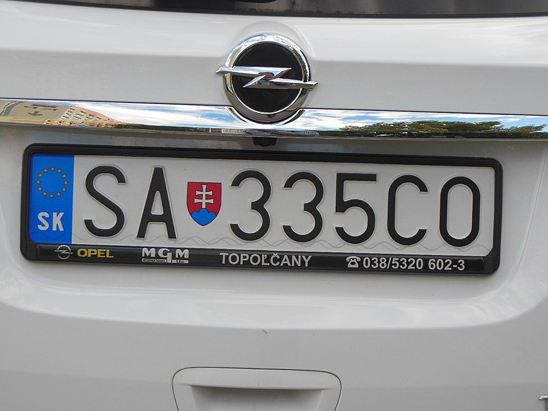
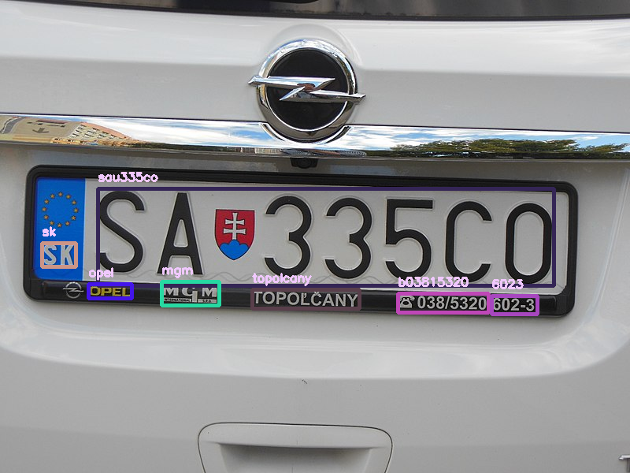

# DEEP_OCR_DEMO

### Preparations

Pretrained weights can be downloaded through this [link](https://www.google.com/search?q=%EA%B5%AC%EA%B8%80+%EB%B2%88%EC%97%AD&sxsrf=ALeKk01rO3H-67qESuC73ilriIX1xUQjng%3A1628508623515&ei=zxERYfr5HrWj1e8P3rqHmA4&oq=%EA%B5%AC%EA%B8%80+%EB%B2%88%EC%97%AD&gs_lcp=Cgdnd3Mtd2l6EAMyBAgjECcyBAgjECcyCwgAEIAEELEDEIMBMgUIABCABDIECAAQQzIFCAAQgAQyBQgAEIAEMgUIABCABDIFCAAQgAQyBQgAEIAEOgcIABBHELADOggIABCABBCxA0oECEEYAFCoCFjXDWD4DmgBcAJ4AYAB4gGIAbcLkgEFMC41LjOYAQCgAQHIAQTAAQE&sclient=gws-wiz&ved=0ahUKEwi6nZKw66PyAhW1UfUHHV7dAeMQ4dUDCA4&uact=5).

---

Directory structure
```
TEXT_DETECTION
TEXT_RECOGNITION
PRETRAINED_WEIGHT/TPS-ResNet-BiLSTM-Attn.pth
                 /text_detection.pth
demo.py
result.png
sample.jpeg
```
---

The demo code can be executed through the command below.
```
python3 demo.py
```

---
### Result

<table>
  <tr>
    <td></td><td></td>
  <tr>
</table>

---

## Acknowledgment
This code is heavily borrowed from [CRAFT](https://github.com/clovaai/CRAFT-pytorch), [deep-text-recognition-benchmark](https://github.com/clovaai/deep-text-recognition-benchmark)
